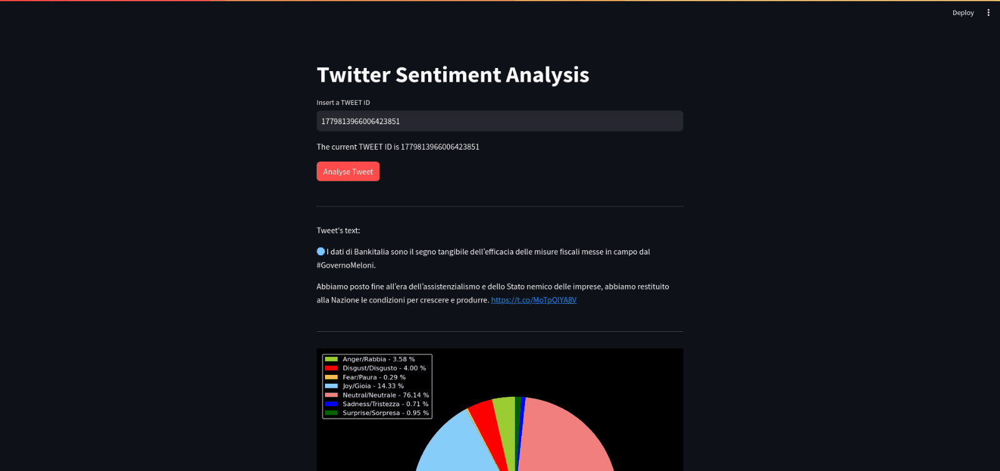

# Sentiment Analysis Twitter

Twitter Sentiment Analysis with Streamlit

This Python code utilizes Streamlit to create a web application for sentiment analysis of tweets. It allows users to enter a tweet ID and displays the sentiment distribution in a pie chart. Additionally, the application saves the analyzed data to a CSV file for further exploration.

Functionality Breakdown:

1. Libraries:

 - The code imports necessary libraries for Twitter access (twikit), text processing (re), machine learning (transformers), data manipulation (pandas), data visualization (matplotlib), and web app development (streamlit).

2. Twitter API Credentials:

(WARNING: Replace placeholders with your actual Twitter API credentials)
  - Username, Email, and Password are required for authentication with the Twitter API through the twikit library.

3. Sentiment Classification Model:

- The code employs a pre-trained model j-hartmann/emotion-english-distilroberta-base from the Transformers library for sentiment classification. It categorizes text into emotions like anger, disgust, fear, joy, neutral, sadness, and surprise.

4. Functions:

- translate_to_english(text): This function translates text to English using an external command-line tool (Ollama) if the original language is Italian.
- remove_urls(text_): Removes URLs from the text to focus on the content itself.
- remove_special_characters(string): Eliminates special characters except for alphanumeric, whitespace, and a few punctuation marks.
- get_text_single_tweet(tweet_id): Fetches a tweet by its ID, performs language detection, pre-processing (cleaning, translation if needed), and returns the cleaned text, original text, language code, user ID, and creation timestamp.
- analyze_text(input_text, tweet_id, orig_, lang_, id_, timestamp_): Analyzes the provided text with the sentiment classification model and returns a list containing the tweet ID, language, and sentiment scores for each emotion category.
- load_or_create_file(filename): Checks if a CSV file (local_dataset.csv) exists to store tweet analysis results. If not, it creates a new file with defined header columns.

5. Streamlit App:

- The Streamlit app interface:

 + Displays a title "Twitter Sentiment Analysis".
 + Provides a text input field for users to enter a tweet ID.
 + Shows a button labeled "Analyse Tweet".

- When the button is clicked:

 + It loads or creates the CSV file for storing results.
 + Checks for duplicate tweet IDs to avoid redundant analysis.
 + If the tweet ID is new:
    * Retrieves the tweet text, original text, language, user ID, and timestamp.
    * Displays the original tweet text.
    * Performs sentiment analysis and generates a pie chart visualizing the distribution of emotions.
    * Creates a new data row with tweet ID, language, and sentiment scores.
    * Appends the new row to the existing data frame.
    * Saves the updated data frame to the CSV file.
+ If the tweet ID already exists:
    * Retrieves the previously analyzed data for that tweet ID from the CSV file.
    * Displays the original tweet text.
    * Presents the pie chart based on the stored sentiment scores.
